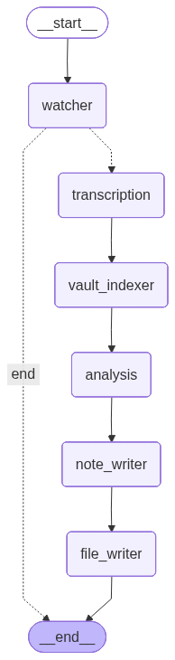

# Whisper2Obsidian

> **Automated voice memo → Obsidian note pipeline using LangGraph, local Whisper transcription, and Groq LLM analysis.**

[](https://python.org)
[](https://developer.apple.com/metal/)

---

## Overview

```
iPhone Voice Record Pro → .m4a + .meta.txt sidecar (Google Drive)
        ↓
[watcher_node]           – detects new files by mtime
                           skips if .md note already in vault inbox
                           signals transcript_cached=True if <stem>.txt exists
        ↓
[transcription_node]     – loads <stem>.txt from disk  OR  runs mlx-whisper
                           writes <stem>.txt + <stem>.json after fresh transcription
        ↓
[vault_indexer_node]     – loads existing tags & links from SQLite vault index
        ↓
[analysis_node]          – Groq Llama-3.3-70b analysis → structured JSON
                           (rate-limited: RPM / TPM / RPD guards)
        ↓
[note_writer_node]       – Jinja2 template (selected by category) → Obsidian Markdown
        ↓
[file_writer_node]       – writes .md to vault inbox, updates SQLite index
```

## Architecture & LangGraph Flow



Whisper2Obsidian is built on [LangGraph](https://python.langchain.com/docs/langgraph), treating the transcription and analysis pipeline as a state-machine diagram. As the system moves from node to node, it updates a shared typed Python dictionary (`W2OState`).

### 1. State (`state.py`)
The pipeline revolves around `W2OState`. It holds everything from initial audio path to the final rendered markdown. Key keys:
- **Watcher Phase:** `audio_path`, `metadata` (parsed sidecar), `already_processed` (database index list), `transcript_cached`
- **Transcription Phase:** `transcript`, `language`, `transcript_token_count`
- **Analysis Phase:** `analysis` (structured Pydantic object from Groq), `groq_tokens_used`
- **Output Phase:** `note_markdown`, `note_filename`, `note_path`
- **Error Handling:** `errors` (list of strings appended by any node)

### 2. Edges & Routing (`graph.py`)
- **START → watcher_node:** The entry point.
- **Conditional Routing:** The watcher checks if there's actually a new `.m4a`. The `has_new_memo` conditional edge function routes to the `transcription_node` if true, or aborts straight to the `END` state if no new audio is found.
- **Linear Pipeline:** Once past the conditional edge, the graph is purely linear: `transcription_node` → `vault_indexer_node` → `analysis_node` → `note_writer_node` → `file_writer_node` → `END`.

### 3. The Nodes
1. **watcher_node:** Scans `AUDIO_FOLDER` for `.m4a` files. Checks both the SQLite cache and the Obsidian inbox filesystem for existing processing markers. Parses `.meta.txt` VRP metadata. Checks for existing `.txt` transcripts to set the `transcript_cached` boolean flag.
2. **transcription_node:** If `transcript_cached` is true, it loads the text directly from the disk. Otherwise, calls `mlx-whisper` on Apple Silicon. Saves the result to a `.txt` and `.json` sidecar to prevent future Whisper calls if the Groq API fails later in the chain.
3. **vault_indexer_node:** Reads the SQLite index database to inject existing Obsidian vault tags and link paths into the state context, enabling the LLM to connect the new memo to your exact existing knowledge graph.
4. **analysis_node:** Connects to Groq (`llama-3.3-70b-versatile`). Protected by the `GroqRateLimiter` service (RPM/TPM/RPD sliding windows). Yields a structured JSON response (title, summary, bullet points, suggested links).
5. **note_writer_node:** Selects a `.j2` Jinja template based on the VRP `Category` (resolves mapping using `CATEGORY_MAP`). Renders the final Markdown note.
6. **file_writer_node:** Writes the final `.md` file to the vault inbox. Uses the exact VRP `Creation Date` to prefix the filename (e.g., `2026-02-25-health.md`). Marks the file as "processed" in SQLite and adds the new tags/links back into the DB index.

---

## Requirements

- **macOS** with Apple Silicon (M1/M2/M3/M4)
- **Python 3.11+**
- **ffmpeg** installed (`brew install ffmpeg`)
- **Groq API key** (free tier is sufficient)
- Google Drive folder mounted locally (no GDrive API needed)

---

## Setup

```bash
# 1. Clone
git clone https://github.com/Michal0lszewski/Whisper2Obsidian.git
cd Whisper2Obsidian

# 2. Create virtual environment
python3 -m venv .venv && source .venv/bin/activate

# 3. Install (mlx-whisper will pull the model on first run)
pip install -e ".[dev]"

# 4. Configure
cp .env.example .env
# Edit .env – set AUDIO_FOLDER, VAULT_PATH, GROQ_API_KEY
nano .env

# 5. Run
whisper2obsidian          # daemon mode (polls every 60s)
whisper2obsidian --once   # process one memo and exit
whisper2obsidian --show-rate-usage   # show Groq token/request counters
```

---

## Configuration (`.env`)

| Variable | Default | Description |
|---|---|---|
| `AUDIO_FOLDER` | _required_ | Path to Google Drive voice memo folder |
| `VAULT_PATH` | _required_ | Obsidian vault root |
| `INBOX_FOLDER` | `00 Inbox` | Sub-folder for new notes |
| `GROQ_API_KEY` | _required_ | Groq API key |
| `GROQ_MODEL` | `llama-3.3-70b-versatile` | Groq model |
| `WHISPER_MODEL` | `mlx-community/whisper-large-v3-mlx` | MLX Whisper model |
| `GROQ_RPM_LIMIT` | `28` | Max requests/min (free cap: 30) |
| `GROQ_TPM_LIMIT` | `11000` | Max tokens/min (free cap: 12 000) |
| `GROQ_RPD_LIMIT` | `950` | Max requests/day (free cap: 1 000) |
| `SHOW_RATE_USAGE` | `false` | Print Groq usage table after each run |
| `LOG_LEVEL` | `INFO` | Logging verbosity |

---

## Voice Record Pro Metadata

The pipeline reads the companion `.meta.txt` file that Voice Record Pro (≥ 4.x)
writes alongside each recording. Fields extracted:

| Meta field | Used for |
|---|---|
| `Category` | Selects the Jinja2 note template (case-insensitive) |
| `Creation Date` | Sets the `date` frontmatter field in the note |
| `Duration` | Sets `duration` frontmatter field (`MM:SS` / `HH:MM:SS`) |
| `Title` | Default note title before LLM refines it |

---

## Note Templates (by category)

Voice Record Pro category → Jinja2 template (case-insensitive, aliases supported):

| VRP Category | Template | Note style |
|---|---|---|
| `books` / `book` / `reading` | `books.md.j2` 📚 | Key takeaways, markmap, status: reading |
| `course` / `lecture` / `class` | `course.md.j2` 🎓 | Key concepts, follow-up tasks, status: review |
| `generic` / `general` / `note` | `default.md.j2` | Key points, action items, NOTE callout |
| `ideas` / `idea` / `brainstorm` | `idea.md.j2` 💡 | Markmap mind-map, TIP callout, status: explore |
| `meeting` / `meetings` | `meeting.md.j2` 📋 | Decisions, action items, IMPORTANT callout |
| `podcast` / `podcasts` | `podcast.md.j2` 🎙️ | Episode insights, follow-ups, status: inbox |
| `research` | `research.md.j2` 🔬 | Concept markmap, findings, status: reading |
| `shopping` / `grocery` | `shopping.md.j2` 🛒 | Checkbox list, context notes, status: open |
| `todo` / `task` / `reminder` | `todo.md.j2` ✅ | Tasks as checkboxes, context, status: open |

All templates include:
- YAML frontmatter with `tags`, `date`, `duration`, `category`, Dataview inline fields
- `[[wiki-links]]` to related notes suggested by the LLM
- Optional Mermaid diagram block
- Collapsible raw transcript callout

---

## Transcript Caching

After Whisper transcribes an audio file, two sidecar files are written **next to the audio**:

```
20260225-094601.m4a        ← original recording
20260225-094601.meta.txt   ← Voice Record Pro metadata
20260225-094601.txt        ← plain-text transcript  ← NEW
20260225-094601.json       ← language, token_count, timestamp  ← NEW
```

**On retry runs** (e.g. if Groq was unreachable the first time):
- The watcher detects no `.md` in the vault inbox → file is not yet fully done
- `transcript_cached=True` is set in state because `.txt` exists
- `transcription_node` loads the `.txt` directly — **Whisper is not re-run**
- Only the Groq analysis call is repeated

To force a fresh transcription, delete the `.txt` file.

---

## "Already processed" logic

A file is considered **done** if **either** condition is true:
1. Its stem is recorded in the SQLite database (`data/w2o.db`) — set by `file_writer_node`
2. A `.md` note whose filename contains the audio stem exists in the vault inbox — filesystem check

The dual check makes the system robust against DB resets and manual vault edits.

---

## Resetting the Pipeline

If you want to quickly force Whisper2Obsidian to reprocess your Voice Record Pro audio files as if they were brand new, you can completely clear the internal tracking database.

Run the following command anywhere in the project:
```bash
w2o-wipe
```
This utility script securely deletes all tracking records (tags, links, and note mappings) from the SQLite `w2o.db` database. **Your original `.m4a` audio files and generated Obsidian `.md` notes are never deleted.**

---

## Obsidian Plugins Used

| Plugin | Usage |
|---|---|
| **Dataview** | Frontmatter + inline `key:: value` fields |
| **Markmind / Markmap** | Mind-map codeblocks in books/idea/course/research notes |
| **Mermaid** | Flowchart diagrams (built into Obsidian) |

---

## Rate Limiting

The `GroqRateLimiter` service guards every Groq API call using a sliding-window algorithm:

- **RPM** and **TPM** tracked via 60-second deque window
- **RPD** tracked via daily counter with midnight reset
- `await_capacity(estimated_tokens)` sleeps automatically if limits would be exceeded
- Configurable via `.env` so you can adjust for a paid Groq tier

---

## Development

```bash
# Run tests
pytest tests/ -v

# Lint
ruff check src/ tests/

# Clear tracking database
w2o-wipe
```

---

## Project Structure

```
src/whisper2obsidian/
├── config.py              # pydantic-settings Config
├── state.py               # LangGraph TypedDict state
├── graph.py               # compile_graph()
├── main.py                # CLI entry point
├── nodes/
│   ├── watcher.py         # file detection + MD-existence check
│   ├── transcription.py   # Whisper + .txt/.json cache
│   ├── vault_indexer.py
│   ├── analysis.py        # Groq LLM analysis (rate-limited)
│   ├── note_writer.py     # Jinja2 template rendering
│   └── file_writer.py     # vault write + SQLite update
├── services/
│   ├── groq_rate_limiter.py
│   ├── metadata_parser.py # .meta.txt / .json / .xml sidecar parser
│   └── vault_index.py
├── scripts/
│   └── wipe_db.py
└── templates/
    ├── default.md.j2
    ├── books.md.j2
    ├── course.md.j2
    ├── idea.md.j2
    ├── meeting.md.j2
    ├── podcast.md.j2
    ├── research.md.j2
    ├── shopping.md.j2
    └── todo.md.j2
```
