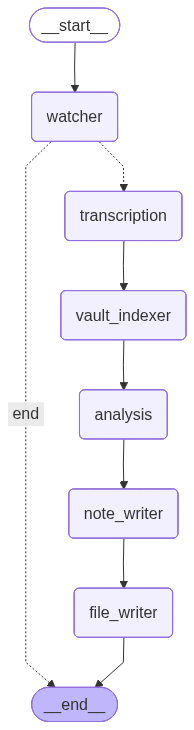

# Whisper2Obsidian

> **Automated voice memo → Obsidian note pipeline using LangGraph, local Whisper transcription, and Groq LLM analysis.**

[](https://python.org)
[](https://developer.apple.com/metal/)

---

## Overview

When you record a new voice memo on your iPhone (e.g. using Voice Record Pro) and save it to a synced Google Drive folder, Whisper2Obsidian automatically detects and processes it into a rich, linked Obsidian note. 

### Step-by-Step Processing Lifecycle:

1. **File Detection:** The **watcher node** constantly scans your `AUDIO_FOLDER`. When a new `.m4a` audio file appears, it reads the associated Voice Record Pro `.meta.txt` sidecar file to extract original creation date, category, and duration.
2. **Local Transcription:** The **transcription node** intercepts the audio. It first checks if a plain-text transcript (`.txt`) has already been cached. If not, it uses Apple Silicon-optimized `mlx-whisper` to transcribe the audio locally into text.
3. **Vault Context Loading:** The **vault indexer node** queries the local SQLite database to load your existing Obsidian tags, ensuring the system knows your current tag vocabulary.
4. **Agentic Semantic Analysis:** The **analysis node** processes the raw transcript using a preferred LLM (Cerebras Llama-3.3-70b for speed, or Groq fallback).
   - *Chunking:* If the transcript is very long, it is split into digestible chunks that are summarised individually, then synthesised back together.
   - *Tools & Context:* The LLM runs a ReAct loop equipped with LangChain tools. It searches a local **ChromaDB vector database** for similar past notes and checks the **SQLite** index for existing tags.
   - *Structuring:* It outputs a strict JSON object mapping out a title, summary, key points, action items, existing tags, and `[[wiki-links]]` to the discovered similar notes.
5. **Markdown Templating:** The **note writer node** takes this JSON and passes it through an Obsidian-compatible Jinja2 template dynamically chosen based on the Voice Record Pro "Category" (e.g., meeting notes get a different layout than generic ideas).
6. **Publishing & Syncing:** The **file writer node** saves the final `.md` file into your Obsidian Inbox. Finally, it updates the **SQLite tracking database** to mark the original memo as processed, and embeds the new note's generated summary into **ChromaDB** so that it can be found in future semantic searches.

## Architecture & LangGraph Flow



Whisper2Obsidian is built on [LangGraph](https://python.langchain.com/docs/langgraph), treating the transcription and analysis pipeline as a state-machine diagram. As the system moves from node to node, it updates a shared typed Python dictionary (`W2OState`).

### 1. State (`state.py`)
The pipeline revolves around `W2OState`. It holds everything from initial audio path to the final rendered markdown. Key keys:
- **Watcher Phase:** `audio_path`, `metadata` (parsed sidecar), `already_processed` (database index list), `transcript_cached`
- **Transcription Phase:** `transcript`, `language`, `transcript_token_count`
- **Analysis Phase:** `analysis` (structured Pydantic object), `total_tokens_used`
- **Output Phase:** `note_markdown`, `note_filename`, `note_path`
- **Error Handling:** `errors` (list of strings appended by any node)

### 2. Edges & Routing (`graph.py`)
- **START → watcher_node:** The entry point.
- **Conditional Routing:** The watcher checks if there's actually a new `.m4a`. The `has_new_memo` conditional edge function routes to the `transcription_node` if true, or aborts straight to the `END` state if no new audio is found.
- **Linear Pipeline:** Once past the conditional edge, the graph is purely linear: `transcription_node` → `vault_indexer_node` → `analysis_node` → `note_writer_node` → `file_writer_node` → `END`.

### 3. The Nodes
1. **watcher_node:** Scans `AUDIO_FOLDER` for `.m4a` files. Checks both the SQLite cache and the Obsidian inbox filesystem for existing processing markers. Parses `.meta.txt` VRP metadata. Checks for existing `.txt` transcripts to set the `transcript_cached` boolean flag.
2. **transcription_node:** If `transcript_cached` is true, it loads the text directly from the disk. Otherwise, calls `mlx-whisper` on Apple Silicon. Saves the result to a `.txt` and `.json` sidecar to prevent future Whisper calls if APIs fail later in the chain. Measures and logs precise transcription execution time.
3. **vault_indexer_node:** Reads the SQLite index database to inject existing Obsidian vault tags into the state context.
4. **analysis_node:** Connects to Cerebras (preferred) or Groq to analyze the transcript. It uses a LangChain ReAct loop with tool-calling to execute semantic searches against the local ChromaDB vector index. Yields a structured JSON response tailored to your existing knowledge base.
5. **note_writer_node:** Selects a `.j2` Jinja template based on the VRP `Category` (resolves mapping using `CATEGORY_MAP`). Renders the final Markdown note.
6. **file_writer_node:** Writes the final `.md` file to the vault inbox. Uses the exact VRP `Creation Date` to prefix the filename (e.g., `2026-02-25-health.md`). Marks the file as "processed" in SQLite and injects the new note's embedding into ChromaDB to empower future semantic searches.

---

## Requirements

- **macOS** with Apple Silicon (M1/M2/M3/M4)
- **Python 3.11+**
- **ffmpeg** installed (`brew install ffmpeg`)
- **API Keys**: Cerebras API key (recommended for speed) or Groq API key (free tier is sufficient)
- Google Drive folder mounted locally (no GDrive API needed)
- **Local DBs**: Implicitly uses SQLite (for progress/tags) and ChromaDB (for vector semantic search) natively.

---

## Setup

```bash
# 1. Clone
git clone https://github.com/Michal0lszewski/Whisper2Obsidian.git
cd Whisper2Obsidian

# 2. Create virtual environment
python3 -m venv .venv && source .venv/bin/activate

# 3. Install (mlx-whisper will pull the model on first run)
pip install -e ".[dev]"

# 4. Configure
cp .env.example .env
# Edit .env – set AUDIO_FOLDER, VAULT_PATH, GROQ_API_KEY
nano .env

# 5. Run
whisper2obsidian          # daemon mode (polls every 60s, auto-harvests on startup)
whisper2obsidian --once   # process one memo and exit
whisper2obsidian --show-rate-usage   # show Groq token/request counters
whisper2obsidian --no-harvest        # skip parsing the existing vault on startup
```

---

## Configuration (`.env`)

| Variable | Default | Description |
|---|---|---|
| `AUDIO_FOLDER` | _required_ | Path to Google Drive voice memo folder |
| `VAULT_PATH` | _required_ | Obsidian vault root |
| `INBOX_FOLDER` | `00 Inbox` | Sub-folder for new notes |
| `CEREBRAS_API_KEY` | _optional_ | Fast inference API Key |
| `CEREBRAS_MODEL` | `llama-3.3-70b` | Cerebras model |
| `GROQ_API_KEY` | _optional_ | Fallback LLM API key |
| `CHROMA_DB_DIR` | `data/chroma` | Local vector index directory |
| `WHISPER_MODEL` | `mlx-community/whisper-large-v3-mlx` | MLX Whisper model |
| `SHOW_RATE_USAGE` | `false` | Print rate limit usage tables |
| `LOG_LEVEL` | `INFO` | Logging verbosity |

---

## Voice Record Pro Metadata

The pipeline reads the companion `.meta.txt` file that Voice Record Pro (≥ 4.x)
writes alongside each recording. Fields extracted:

| Meta field | Used for |
|---|---|
| `Category` | Selects the Jinja2 note template (case-insensitive) |
| `Creation Date` | Sets the `date` frontmatter field in the note |
| `Duration` | Sets `duration` frontmatter field (`MM:SS` / `HH:MM:SS`) |
| `Title` | Default note title before LLM refines it |

---

## Note Templates (by category)

Voice Record Pro category → Jinja2 template (case-insensitive, aliases supported):

| VRP Category | Template | Note style |
|---|---|---|
| `books` / `book` / `reading` | `books.md.j2` 📚 | Key takeaways, markmap, status: reading |
| `course` / `lecture` / `class` | `course.md.j2` 🎓 | Key concepts, follow-up tasks, status: review |
| `generic` / `general` / `note` | `default.md.j2` | Key points, action items, NOTE callout |
| `ideas` / `idea` / `brainstorm` | `idea.md.j2` 💡 | Markmap mind-map, TIP callout, status: explore |
| `meeting` / `meetings` | `meeting.md.j2` 📋 | Decisions, action items, IMPORTANT callout |
| `podcast` / `podcasts` | `podcast.md.j2` 🎙️ | Episode insights, follow-ups, status: inbox |
| `research` | `research.md.j2` 🔬 | Concept markmap, findings, status: reading |
| `shopping` / `grocery` | `shopping.md.j2` 🛒 | Checkbox list, context notes, status: open |
| `todo` / `task` / `reminder` | `todo.md.j2` ✅ | Tasks as checkboxes, context, status: open |

All templates include:
- YAML frontmatter with `tags`, `date`, `duration`, `category`, Dataview inline fields
- `[[wiki-links]]` to related notes suggested by the LLM
- Optional Mermaid diagram block
- Collapsible raw transcript callout

---

## Transcript Caching

After Whisper transcribes an audio file, two sidecar files are written **next to the audio**:

```
20260225-094601.m4a        ← original recording
20260225-094601.meta.txt   ← Voice Record Pro metadata
20260225-094601.txt        ← plain-text transcript  ← NEW
20260225-094601.json       ← language, token_count, timestamp  ← NEW
```

**On retry runs** (e.g. if Groq was unreachable the first time):
- The watcher detects no `.md` in the vault inbox → file is not yet fully done
- `transcript_cached=True` is set in state because `.txt` exists
- `transcription_node` loads the `.txt` directly — **Whisper is not re-run**
- Only the Groq analysis call is repeated

To force a fresh transcription, delete the `.txt` file.

---

## "Already processed" logic

A file is considered **done** if **either** condition is true:
1. Its stem is recorded in the SQLite database (`data/w2o.db`) — set by `file_writer_node`
2. A `.md` note whose filename contains the audio stem exists in the vault inbox — filesystem check

The dual check makes the system robust against DB resets and manual vault edits.

---

## Indexing Existing Vault Notes (First-Time Usage & Syncing)

To empower the semantic search functionality, Whisper2Obsidian maintains a local `ChromaDB` vector index summarizing your historical Obsidian notes and an `SQLite` database of your existing tags.

**When you launch Whisper2Obsidian (`whisper2obsidian`), it will automatically run a "harvest" process before it begins listening for new voice memos.** 

This ensures that any notes you have created or edited manually inside Obsidian are picked up by the system, allowing incoming voice memos to accurately link to your newest thoughts and use your established tagging vocabulary.

*(If you have a massive vault and want to skip this startup check to begin transcribing immediately, you can pass the `--no-harvest` flag, or run the script manually at `uv run python src/whisper2obsidian/scripts/vault_harvest.py`)*

**What it does:**
1. Scans all `.md` files in your configured `VAULT_PATH`.
2. Extracts tags and stores them in the local SQLite database (`w2o.db`).
3. Asks the LLM to generate a dense 500-character summary for each note.
4. Embeds these summaries into ChromaDB.
5. It only processes files whose modification time has changed since the last run.

---

## Data Storage

> 🔒 **Privacy:** Both databases live in `data/` and are git-ignored. Your vault content never leaves your machine.

### SQLite — `data/w2o.db`

Three tables power the pipeline's "memory":

| Table | Columns | Purpose |
|---|---|---|
| `processed_files` | `stem TEXT PRIMARY KEY`, `processed_at TEXT` | Tracks which audio file stems have already been turned into notes, preventing double-processing |
| `notes` | `stem TEXT PK`, `title TEXT`, `path TEXT`, `file_mtime REAL` | Maps every vault note stem to its title and file path; `file_mtime` is used by the harvester to detect edits |
| `note_tags` | `stem TEXT`, `tag TEXT` | Many-to-many: which tags each note has. Used by `get_known_tags` to return your full tag vocabulary to the LLM |
| `note_links` | `stem TEXT`, `link TEXT` | Many-to-many: explicit wiki-links between notes — stored for future cross-link analysis |

**Key operations:**
- `mark_processed(stem)` — called by `file_writer_node` once a note is successfully written
- `all_tags()` — called by the `get_known_tags` tool; returns a deduplicated list of all tags across the vault
- Harvester: **detects deleted notes** (DB rows with no matching `.md` file) and garbage-collects them — this cascades across all three SQLite tables (`notes`, `tags`, `links`) AND removes the embedding from ChromaDB. No orphaned tags or stale vectors are left behind.

> **What happens when you delete a note from Obsidian?**
> The next time Whisper2Obsidian starts (or the harvester runs), it detects the missing file and automatically:
> 1. Removes its row from the `notes` table
> 2. Removes **all its tags** from the `tags` table — `get_known_tags` will never return tags from deleted notes
> 3. Removes its outgoing links from the `links` table
> 4. Deletes its 384-dim embedding from the ChromaDB `vault_notes` collection
>
> The only window where stale data could exist is between deleting the note and the next startup — no incorrect notes or links will be created in that window.

### ChromaDB — `data/chroma/` (Collection: `vault_notes`)

Each entry in the `vault_notes` collection represents one Obsidian note:

| Field | Type | Example |
|---|---|---|
| **ID** | string | `2026-02-27-idea` (the note stem) |
| **document** | string (~500 chars) | LLM-generated dense prose summary of the note |
| **metadata.title** | string | `💡 AI Newsletter Generator` |
| **metadata.path** | string | `00 Notes/2026-02-27-idea.md` (vault-relative) |
| **embedding** | float[384] | Semantic vector from `all-MiniLM-L6-v2` |

**How it's used:**
- When the LLM calls `search_similar_notes(query)`, ChromaDB runs a **cosine similarity search** over the 384-dimensional embeddings
- The top-N matches (stem + title + summary) are returned to the LLM so it can decide whether to add a `[[wikilink]]` to the note
- The 384-dim vectors come from ChromaDB's default **`all-MiniLM-L6-v2`** sentence transformer — compact, fast, local, no API call required

---


## Resetting the Pipeline

If you want to quickly force Whisper2Obsidian to reprocess your Voice Record Pro audio files as if they were brand new, you can completely clear the internal tracking database.

Run the following command anywhere in the project:
```bash
w2o-wipe
```
This utility script securely deletes all tracking records (tags, links, and note mappings) from the SQLite `w2o.db` database. **Your original `.m4a` audio files and generated Obsidian `.md` notes are never deleted.**

---

## Obsidian Plugins Used

| Plugin | Usage |
|---|---|
| **Dataview** | Frontmatter + inline `key:: value` fields |
| **Markmap** | Mind-map codeblocks in books/idea/course/research notes |
| **Mermaid** | Flowchart diagrams (built into Obsidian) |

---

## Rate Limiting

The `LLMRateLimiter` service guards every LLM API call using a sliding-window algorithm tailored to the specific provider (Cerebras or Groq) in use:

- **RPM** and **TPM** tracked via 60-second deque window
- **RPD** tracked via daily counter with midnight reset
- `await_capacity(estimated_tokens)` sleeps automatically if limits would be exceeded
- Configurable via `.env` so you can adjust based on your specific free API tier.

---

## Development

```bash
# Run tests
pytest tests/ -v

# Lint
ruff check src/ tests/

# Clear tracking database
w2o-wipe
```

---

## Project Structure

```
src/whisper2obsidian/
├── config.py              # pydantic-settings Config
├── state.py               # LangGraph TypedDict state
├── graph.py               # compile_graph()
├── main.py                # CLI entry point
├── nodes/
│   ├── watcher.py         # file detection + MD-existence check
│   ├── transcription.py   # Whisper + .txt/.json cache
│   ├── vault_indexer.py
│   ├── analysis.py        # Groq LLM analysis (rate-limited)
│   ├── note_writer.py     # Jinja2 template rendering
│   └── file_writer.py     # vault write + SQLite update
├── services/
│   ├── llm_rate_limiter.py    # Sliding window rate guards
│   ├── metadata_parser.py     # .meta.txt / .json / .xml sidecar parser
│   └── vault_index.py
├── scripts/
│   └── wipe_db.py
└── templates/
    ├── default.md.j2
    ├── books.md.j2
    ├── course.md.j2
    ├── idea.md.j2
    ├── meeting.md.j2
    ├── podcast.md.j2
    ├── research.md.j2
    ├── shopping.md.j2
    └── todo.md.j2
```
